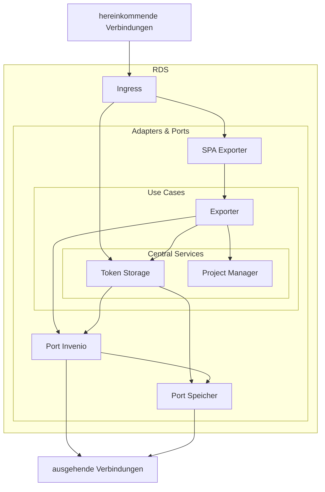

## Diagramm
Das folgende Diagramm zeigt den Datenfluss innerhalb des Service Ökosystems.

```mermaid
graph TD;
  %% define nodes

  WWWI[hereinkommende Verbindungen]

  subgraph RDS
    Ingress

    subgraph Adapters & Ports
      SPAEx[SPA Exporter]
      %% SPATS[SPA Token Storage]

      PInvenio[Port Invenio]
      PStorage[Port Speicher]

      subgraph Use Cases
        UCEx[Exporter]

        subgraph Central Services
          CSTS[Token Storage]
          CSPM[Project Manager]
        end
      end
    end
  end


  WWWO[ausgehende Verbindungen]

  click SPAEx "/sciebo-rds/de/doc/impl/adapters/spa-exporter/"
  click SPATS "/sciebo-rds/de/doc/impl/adapters/spa-token-storage"
  click UCEx "/sciebo-rds/de/doc/impl/use-cases/exporter"
  click CSTS "/sciebo-rds/de/doc/impl/central/token-storage"
  click CSPM "/sciebo-rds/de/doc/impl/central/project-manager"
  click PInvenio "/sciebo-rds/de/doc/impl/adapters/port-invenio"
  click PStorage "/sciebo-rds/de/doc/impl/adapters/port-storage"

  %% define connections
  WWWI --> Ingress

  Ingress --> SPAEx --> UCEx
  %% Ingress --> SPATS --> CSTS
  Ingress --> CSTS

  UCEx --> CSTS
  UCEx --> CSPM
  UCEx --> PInvenio
  
  CSTS --> PInvenio
  CSTS --> PStorage

  PInvenio --> PStorage

  PInvenio --> WWWO
  PStorage --> WWWO
```
