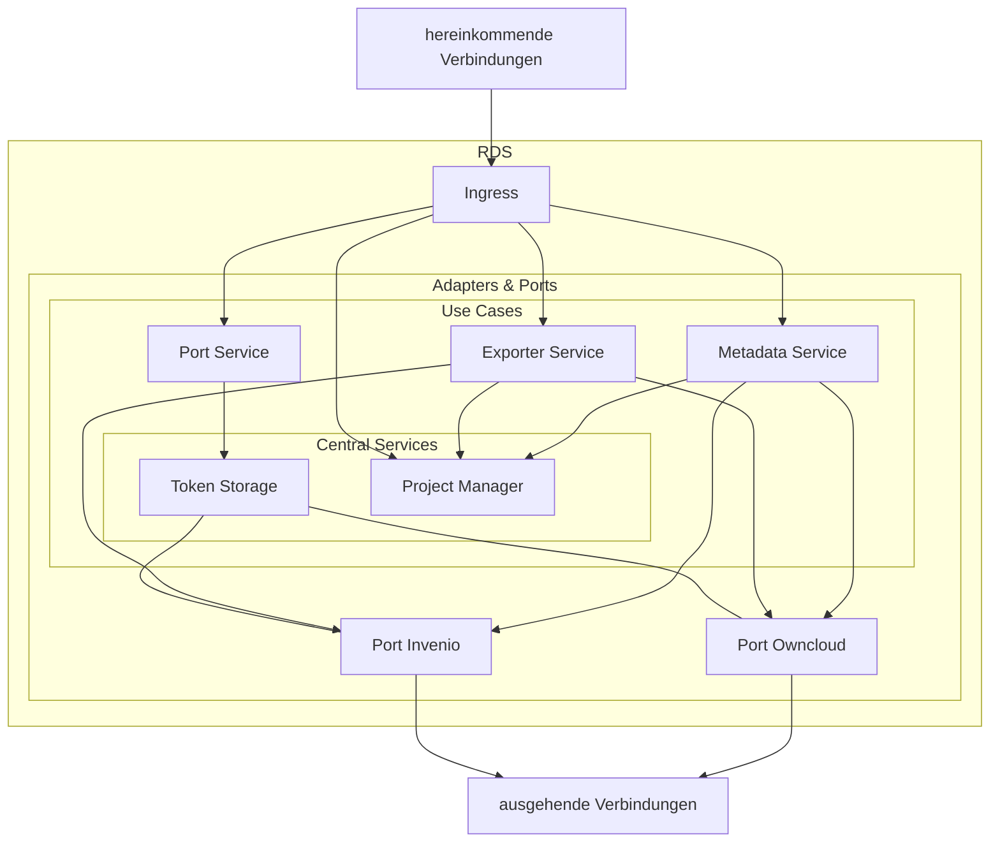

## Diagramm

Das folgende Diagramm zeigt den Datenfluss innerhalb des Service Ökosystems. Jeder Service ist verlinkt, sodass man von hier aus sehr schnell in die entsprechende Dokumentation schauen kann, indem man auf den jeweiligen Knoten drückt.

