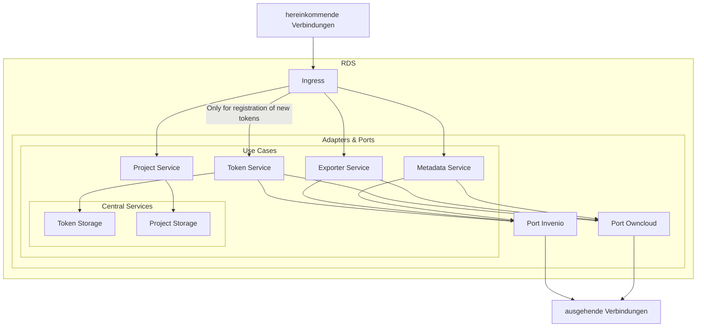

## Diagram

The following diagram shows the data flow within the Service Ecosystem. Each service is linked so that you can quickly look up the corresponding documentation from here.

```mermaid
graph TD;
  %% define nodes

  WWWI[hereinkommende Verbindungen]

  subgraph RDS
    Ingress

    subgraph Adapters & Ports
      %% SPAEx[SPA Exporter]
      %% SPATS[SPA Token Storage]

      PInvenio[Port Invenio]
      POwncloud[Port Owncloud]

      subgraph Use Cases
        UCExporter[Exporter Service]
        UCToken[Token Service]
        UCMetadata[Metadata Service]
        UCProject[Project Service]

        subgraph Central Services
          CSToken[Token Storage]
          CSProject[Project Storage]
        end
      end
    end
  end

  WWWO[ausgehende Verbindungen]

  click SPAEx "/doc/impl/adapters/spa-exporter/"
  click SPATS "/doc/impl/adapters/spa-token-storage"
  click UCExporter "/doc/impl/use-cases/exporter"
  click UCToken "/doc/impl/use-cases/token-service"
  click CSToken "/doc/impl/central/token-storage"
  click CSProject "/doc/impl/central/research-manager"
  click PInvenio "/doc/impl/ports/port-invenio"
  click POwncloud "/doc/impl/ports/port-storage"

  %% define connections
  WWWI --> Ingress

  %% Ingress --> SPAEx --> UCExporter
  %% Ingress --> SPATS --> CSToken
  Ingress -->|Only for registration of new tokens| UCToken
  Ingress --> UCProject & UCExporter & UCMetadata

  %% UCExporter --> UCProject
  UCProject --> CSProject

  UCToken --> CSToken

  UCToken --- PInvenio & POwncloud
  UCExporter & UCMetadata --> PInvenio & POwncloud

  %% PInvenio --> POwncloud

  PInvenio --> WWWO
  POwncloud --> WWWO
```