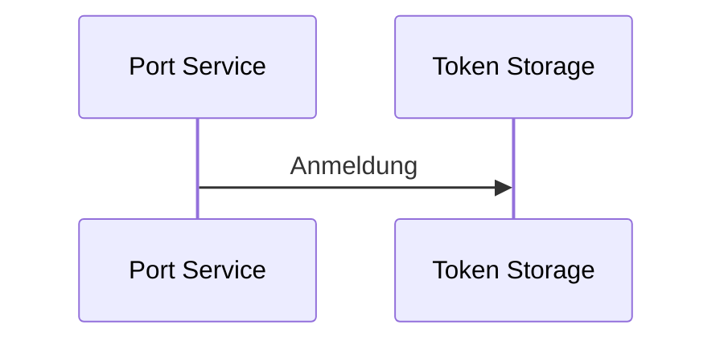

Hier wird im Folgenden beschrieben, wie die Microservices zusammenarbeiten und wie ein neuer erzeugt und in das System integriert wird. Dabei wird noch einmal auf die Architektur eingegangen, sowie einige Begriffe geklärt, um anschließend auf den Ablauf und die Implementierung eines Services einzugehen. Außerdem wird beschrieben, wie man die Gitlab CI Pipeline verwendet und für den neuen Service konfiguriert.

# Architektur

Der Vorteil der Microservice Architektur ist darin, dass jeder Service in einer anderen Sprache geschrieben werden kann, um so bestmöglich das Problem lösen zu können, welches es gilt zu lösen. Aktuell sind die meisten Microservices in Python3 geschrieben, sodass auch sämtliche zur Verfügung stehende Bibliotheken und Erleichterungen in dieser Sprache geschrieben sind.

Falls Du noch nicht die [Architektur und dessen Konzepte](/de/doc/arc42/indroduction/) verinnerlicht hast, solltest Du jetzt eine Pause hier einlegen und zuerst die [entsprechende Dokumentation](/de/doc/arc42/ecosystem/) lesen, bevor Du hier weitermachst.

Rufe Dir bitte noch einmal in Erinnerung, dass in der dritten und tiefsten Schicht die wichtigsten Komponenten des Systems laufen. Darunter der [Token Storage](/de/doc/impl/central/token-storage/) und der [Research Manager](/de/doc/impl/central/research-manager/). Diese sind besonders wichtig für den weiteren Ablauf, da diese Definieren auf welche Dienste der Nutzer zugreifen kann.

## Projektbegriff im RDS Kontext

Da sich RDS als Metasystem versteht, welches andere Systeme und Dienste verbindet, ist es notwendig ein Projekt innerhalb von RDS zu erzeugen, welches der Nutzer selbstständig konfigurieren kann. Allerdings verwenden viele Systeme den Begriff des Projektes, sodass bei Besprechungen Verwirrungen entstehen können, sobald RDS als System zum Einsatz kommen soll, um die Projekte der verschiedenen Dienste mittels RDS zu verbinden (welches die Verbindungen wiederum als Projekt organisiert).

Aus diesem Grund haben wir uns entschieden den Begriff des *Forschungskontextes* zu verwenden, welches Synonym zum (Forschungs-)projekt genutzt werden soll, sodass diese Verwirrungen reduziert werden.

## Wahl der Schicht

Bevor wir beginnen, solltest Du Dir klar machen, in welcher Schicht dein Microservice einzuordnen ist.

* **Schicht 1**: dein Microservice integriert einen Dienst in das RDS Ökosystem. Dein Service wird *Port Service* genannt.
* **Schicht 2**: dein Microservice nutzt einen Microservice aus Schicht 1 und / oder Schicht 3 und verarbeitet Informationen, speichert aber keine Informationen, er ist also Zustandslos. Dein Service wird *UseCase Service* genannt.
* **Schicht 3**: dein Microservice ist essenziell für das gesamte Ökosystem und / oder speichert Informationen ab. Dein Service wird *Central Service* genannt.

Sollte dein Dienst in keine der Schichten eindeutig einzuordnen sein, dann solltest Du Dir Gedanken über eine konzeptionelle Aufteilung deines Services in mehrere Microservices machen, sodass die Funktionen, welche Du implementierst, von möglichst vielen anderen Services verwendet werden können.

Als Daumenregeln solltest Du folgendes beachten:

Ein Microservice verfolgt grundsätzlich nur ein Ziel und dessen Aufgabe lässt sich mit einem Satz beschreiben. Dies garantiert die Wiederverwendbarkeit und reduziert die Komplexität deines Services. Außerdem wird damit Abhängigkeit des Gesamtsystems auf einige wenige Services reduziert (siehe [Clean Architecture](/de/doc/arc42/contextboundary/#section-solid-arch)).


# Ablauf und Implementierung

Im Folgenden wird der generelle Ablauf, sowie die Implementierung und Integration des Services in das RDS System beschrieben. Im vorherigen Abschnitt wurde beschrieben, wie Du Dir deutlich machen kannst, in welcher Schicht dein Dienst sein kann, sodass Du hier nun im entsprechenden Abschnitt nachschlagen kannst, wie Du deinen Service im RDS System integrieren kannst.

## Schicht 1

Da dein Microservice einen Dienst in das RDS System integriert, muss er sich im Token Storage registrieren, sodass dieser deinen Microservice in den Plugins im Anmeldeprozess anbieten kann. Dabei benötigt der Token Storage sämtliche Oauth2-Workflow-Informationen (Client ID, Client Secret, authorize url, etc.). Dafür nutzt Du den */service* Endpunkt des [Token Storage](/de/doc/impl/central/token-storage).



Dein Port Service sollte die Anmeldung als einer der ersten Schritte machen, bevor der API-Service gestartet wird. Bei der Anmeldung musst Du angeben, welches Interface (dazu gleich mehr) implementiert wurde. Dieses Interface ist wichtig, da dein Service später durch andere Microservices verwendet werden soll. RDS benutzt mehrere OpenAPIv3 Spezifikation, um die Kommunikation zwischen den Microservices zu gewährleisten.

Da dein Dienst in Schicht 1 liegt, kann er von anderen Microservices als [Dateien](https://raw.githubusercontent.com/Sciebo-RDS/Sciebo-RDS/informations-ep/RDS/circle2_use_cases/interface_port_file_storage.yml)- ([Beispiel: Owncloud](/de/doc/impl/ports/port-owncloud/)) und / oder [Metadatenspeicher](https://raw.githubusercontent.com/Sciebo-RDS/Sciebo-RDS/informations-ep/RDS/circle2_use_cases/interface_port_metadata.yml) ([Beispiel: Zenodo](/de/doc/impl/ports/port-invenio/)) verwendet werden.

Mit der folgenden Python-Funktion kannst Du deinen Service beim *Token Storage* anmelden.

```python
def register_service(servicename: str, authorize_url: str, refresh_url: str, client_id: str, client_secret: str):
    tokenStorage = os.getenv("CENTRAL_SERVICE_TOKEN_STORAGE")
    if tokenStorage is None:
        return False

    data = {
        "servicename": servicename,
        "authorize_url": authorize_url,
        "refresh_url": refresh_url,
        "client_id": client_id,
        "client_secret": client_secret,
        "implements": ["fileStorage", "metadata"]
    }
    headers = {"Content-Type": "application/json"}

    response = requests.post(
        f"{tokenStorage}/service", json=data, headers=headers)

    if response.status_code is not 200:
        raise Exception(
            "Cannot find and register Token Storage, msg:\n{}".format(response.text))

    response = response.json()
    if response["success"]:
        logger.info(
            f"Registering {servicename} in token storage was successful.")
        return True

    logger.error(
        f"There was an error while registering {servicename} to token storage.\nJSON: {response}")

    return False
```

 Beachte, dass im Data-Dict im "implements"-Key eine Liste hinterlegt ist, welche von Dir angepasst werden muss; je nachdem, welches Interface Du implementierst.

| Interface | Implements | 
| --- |---|
| Dateienspeicher | fileStorage |
| Metadatenspeicher | metadata |

## Schicht 2 und 3

Dein Dienst benötigt keine Anmeldung, da er direkt per GUI aufgerufen wird oder andere Dienste selbstständig aufruft.

## Connexion-Plus

Um die Arbeit mit Python in Verbindung mit Flask erheblich zu vereinfachen, wurde zu Beginn auf Connexion zurückgegriffen, da dies aus einer OpenAPIv3-Spezifikation direkt einen API-Server mittels Flask aufsetzt. Durch das Hinzufügen von Funktionalitäten und Erweitern von einigen weiteren Bibliotheken entstand [Connexion-Plus](https://pypi.org/project/connexion-plus/). Es wird dringend empfohlen, diese Bibliothek zu verwenden, da viele Funktionen wie Opentracing und Prometheus-Metriken automatisch hinzugefügt werden, welche für eine erfolgreiche Integration benötigt werden (siehe [Beitragen](/de/doc/contribute/)).

## Gitlab CI

RDS nutzt Gitlab und dessen CI System, um den Quelltext zu testen und weitere Funktionen aufzurufen, u.a. das Erzeugen von Containern und das Publizieren derselbigen.

Um die Gitlab-CI zu verwenden, wird eine *.gitlab-ci.yaml* im Projektordner benötigt. Als Beispiel solltest Du mal in eine bereits existieren schauen ([Beispiel: Owncloud](https://github.com/Sciebo-RDS/Sciebo-RDS/blob/master/RDS/circle1_adapters_and_ports/port_owncloud/.gitlab-ci.yml)).

In dieser Datei kannst Du beschreiben, wie dein Service getestet, gebaut und abgelegt wird. Dafür verwendest Du bereits existierende Jobs aus der zentralen [*.gitlab-ci.yaml* Datei](https://github.com/Sciebo-RDS/Sciebo-RDS/blob/master/.gitlab-ci.yml#L68) im Root-Verzeichnis des Git-Repositoriums. Außerdem hinterlegst Du deine neu erzeugte Datei in die *includes* in dieser zentralen Datei, sodass sie auch ausgeführt wird von der Pipeline bei einem *Pull Request*.

Solltest Du nicht die vordefinierten Abläufe verwenden wollen, so musst Du diese überschreiben, indem Du eigene *script*-Abschnitte angibst. Andernfalls wird eine *Makefile* ([Beispiel: Owncloud](https://github.com/Sciebo-RDS/Sciebo-RDS/blob/master/RDS/circle1_adapters_and_ports/port_owncloud/Makefile)) benötigt, welche ausgeführt wird, um deinen Service zu testen, zu bauen und anschließend im Paketverzeichnis des Gitlabs anzubieten.


Es wird dringend empfohlen die benötigten Abläufe über Makefiles zu realisieren und nicht die Skripte in der .gitlab-ci.yaml Datei zu überschreiben, da dies zu Problemen in der Pipeline führen kann. In Makefiles sind diese Fehler vermeidbar. Beachte: Die Pipeline verwendet Ubuntu als Grundlage.


### Dokumentation

Dein Service sollte die eigene Dokumentation automatisch aktuell halten, sodass eine Weiterverwendung von anderen Nutzern anhand der Dokumentation gewährleistet ist. Hierfür solltest Du einen Blick in einen bereits bestehenden Service werfen ([Beispiel: Owncloud](https://github.com/Sciebo-RDS/Sciebo-RDS/blob/master/RDS/circle1_adapters_and_ports/port_owncloud/Makefile#L26)). Dort siehst Du wie mithilfe von [pydoc-markdown](https://pypi.org/project/pydoc-markdown/) ([Beachte: Issue 43](https://github.com/Sciebo-RDS/Sciebo-RDS/issues/43)) und Pythons DocString eine Markdown-Datei erzeugt wird und in den richtigen Ordner der Dokumentation verschoben wird (Beachte: [pydocmd.yml](https://github.com/Sciebo-RDS/Sciebo-RDS/blob/master/RDS/circle1_adapters_and_ports/port_owncloud/pydocmd.yml) im selben Ordner). Dort existiert dann eine weitere Markdown-Datei, welche diese neue Markdown-Datei mithilfe des Code-Shortcodes einbindet ([Beispiel: Owncloud](https://raw.githubusercontent.com/Sciebo-RDS/Sciebo-RDS/master/docs/content/doc/impl/ports/port-owncloud.de.md)). Dieselbe Funktionalität solltest Du auch implementieren, sodass beim Merge deines Pull Requests die [Webseite](https://www.research-data-services.org/de/doc/impl/ports/port-owncloud/) durch die Gitlab-CI Pipeline aktualisiert wird. Dies gilt übrigens immer, sobald eine Änderung an deinem Code festgestellt wird, sodass nicht nur ein Merge diese Automatisierung auslöst.

### Dockerfile

Um einen Container zu bauen, benötigt dein Service eine *dockerfile* ([Beispiel: Owncloud](https://github.com/Sciebo-RDS/Sciebo-RDS/blob/master/RDS/circle1_adapters_and_ports/port_owncloud/dockerfile)) im Projektordner (derselbe, indem auch die *.gitlab-ci.yaml* liegt, beachte außerdem die Groß- und Kleinschreibung).

In dieser kannst Du den Bauprozess definieren, welche Pakete und Programme installiert und deine Software ausgeführt wird.

### Kubernetes und Helm Chart

In RDS nutzen wir Helm Charts, um die Konfigurationsdateien für Kubernetes zu erzeugen. Daher benötigt auch dein Service einen entsprechenden [Helm Chart](https://helm.sh/). Im Ordner [deploy](https://github.com/Sciebo-RDS/getting-started/tree/master/deploy) des Git-Repositoriums findest Du alle bisher verfügbaren Charts, sowie eine [Makefile](https://github.com/Sciebo-RDS/getting-started/tree/master/deploy/Makefile) mithilfe dessen Du die verfügbaren Charts auf einen existierenden Kubernetes Cluster anwenden kannst.

Erzeuge Dir zuerst einen Ordner, dessen Namen der Konvention entspricht: *circle[1,2,3]_servicename*. Anschließend folge dem [Helm Developers Guide](https://helm.sh/docs/chart_template_guide/), um Dir einen eigenen Chart im neuen Ordner zu erzeugen und zu konfigurieren.

Anschließend ergänze die Makefile im *deploy*-Ordner, damit dein Service im Kubernetes aufgesetzt wird. Dafür erstellst Du Dir zwei eigene Prozedur:
- die erste installiert oder erneuert deinen Service und
- die zweite deinstalliert deinen Service

Am besten hat deine zweite Prozedur denselben Namen wie die erste, nur mit dem Zusatz *remove\_* davor (Beispiel: [port_owncloud](https://github.com/Sciebo-RDS/getting-started/tree/master/deploy/Makefile#L44) und [remove_port_owncloud](https://github.com/Sciebo-RDS/getting-started/tree/master/deploy/Makefile#L77)). Anschließend fügst du deine erste Prozedur der entsprechenden Prozedur *circle1*, *circle2* oder *circle3* ([siehe Makefile](https://github.com/Sciebo-RDS/getting-started/tree/master/deploy/Makefile#L62)) zu. Gleiches gilt auch für deine *remove\_* Prozedur, welche zu einer der folgenden Prozeduren angefügt wird: *uninstall_circle1*, *uninstall_circle2* oder *uninstall_circle3* ([siehe Makefile](https://github.com/Sciebo-RDS/getting-started/tree/master/deploy/Makefile#L95))

# Integration in GUI Plugins

Aktuell ist es notwendig, solltest Du einen neuen Dienst in Schicht 2 oder 3 implementieren, selbst Hand anzulegen in den Plugins, da diese zum aktuellen Zeitpunkt keinerlei Automatismus besitzen, um die neuen Endpunkte zu integrieren. Alle verfügbaren Plugins findest Du im gleichnamigen Ordner im root-Verzeichnis des Git Repositoriums. Die Dienste in Schicht 1, welche als Port Service bezeichnet werden, werden automatisch durch den Token Storage angeboten, dem Research Manager verbunden und durch den Metadata- und Exporter-Service verwendet.

Wähle ein Plugin aus ([Beispiel: Owncloud](https://github.com/Sciebo-RDS/plugin-ownCloud)) und siehe Dir die Integration an. (Owncloud bietet selbst ein [Developer Handbuch](https://doc.owncloud.com/server/developer_manual/) an.)

# Beispielservice

Aktuell existiert leider noch kein Beispielservice. ([Siehe Issue 42](https://github.com/Sciebo-RDS/Sciebo-RDS/issues/42))
