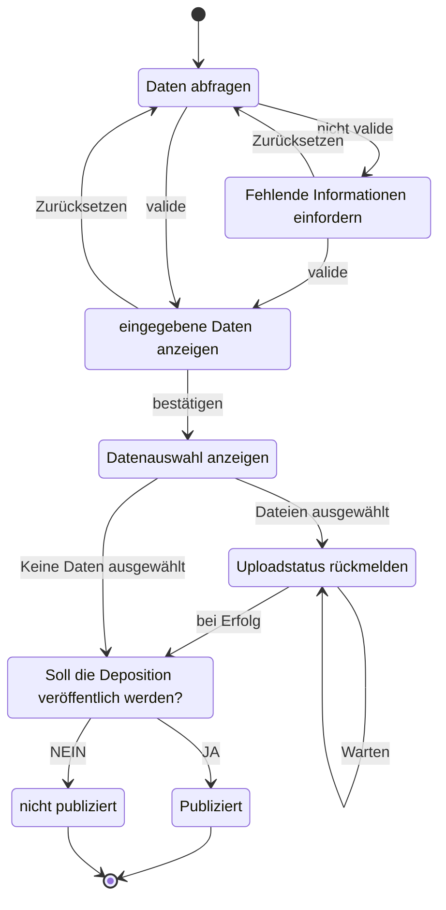

Erstes Inkrement unterstützt nur minimaler Datensatz.

Die Eingabemaske DEA des Adapters für den Zenodo Services

```mermaid
stateDiagram
  [*] --> A
  A --> B: nicht valide
  B --> C: valide
  C --> D: bestätigen
  D --> E: Dateien ausgewählt
  E --> F: bei Erfolg
  E --> E: Warten
  F --> G: JA
  F --> H: NEIN
  G --> [*]
  H --> [*]
  B --> A: Zurücksetzen
  C --> A: Zurücksetzen
  D --> F: Keine Daten ausgewählt
  A --> C: valide

  A: Daten abfragen
  B: Fehlende Informationen einfordern
  C: eingegebene Daten anzeigen
  D: Datenauswahl anzeigen
  E: Uploadstatus rückmelden
  F: Soll die Deposition veröffentlich werden?
  G: Publiziert
  H: nicht publiziert
```

