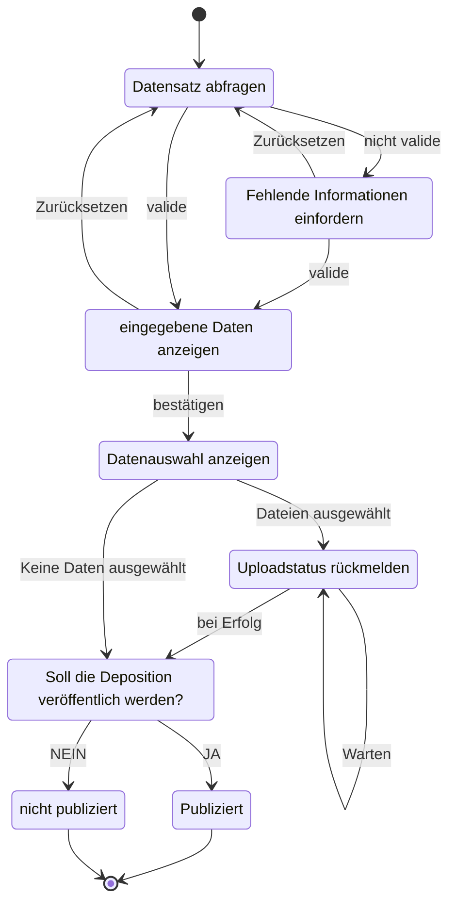

## Minimaler Datensatz

Erstes Inkrement unterstützt nur minimaler Datensatz.
Der minimale Datensatz besteht aus den folgenden Informationen, welche der Entität [Deposit Metadata](https://developers.zenodo.org/#representation) entspricht:

|       Name       |    Typ     |                           Beschreibung                           |
|------------------|------------|------------------------------------------------------------------|
|      titel       |   String   |                     Der Titel der Deposition                     |
|   description    |   String   |                 Eine Beschreibung der Deposition                 |
| publication_date |    Date    | Ein Datumsobjekt, welches den Veröffentlichungszeitpunkt angibt. |
|   upload_type    | Enumerator |      Die Art der Deposition (Vortrag, Paper, Poster, etc.)       |

## DEA der Eingabemasken

Der Ablauf der Eingabemasken des Adapters für den Zenodo Services werden durch den folgenden DEA dargestellt.

