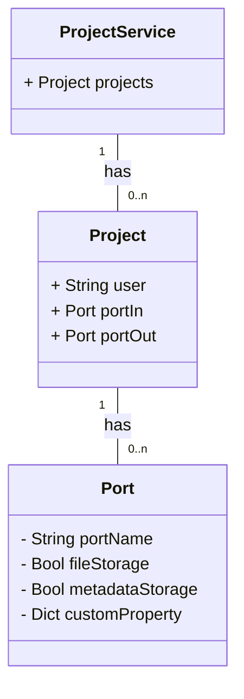

# Einführung

Dieser Service stellt einen projektbasierten Informationsspeicher dar, sodass alle anderen Microservices sich auf diese berufen können. Hier wird u.a. festgestellt, welche Ports verwendet werden sollen beim Veröffentlichen von Daten.

## ER-Diagramm

Das interne Informationsmodell wird im folgenden als UML-Diagramm dargestellt, soll aber bitte als ER-Diagramm verstanden werden.

# OpenAPI v3



{}
