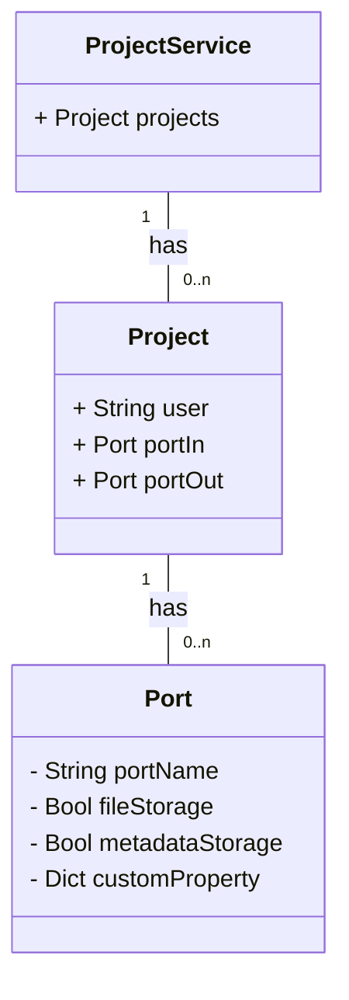

# Einführung

Dieser Service stellt einen projektbasierten Informationsspeicher dar, sodass alle anderen Microservices sich auf diese berufen können. Hier wird u.a. festgestellt, welche Ports verwendet werden sollen beim Veröffentlichen von Daten.

## Erklärung des Begriffes Forschungsprojekt (engl. Research)

Aufgrund der sehr hohen Häufigkeit des Begriffes *Projekt* in der Informatik und den angeschlossenen Diensten, mussten wir einen anderen Begriff wählen innerhalb des RDS-Systems, um die Kommunikation zwischen Anwendern und/oder Entwicklern zu vereinfachen. Aus diesem Grund wählten wir den Begriff des Forschungsprojektes, um Projekte innerhalb des RDS-Systems zu bezeichnen, welches man lose ins Englische mit *Research* übesetzen kann, um stets abgrenzen zu können, welches Projekt im Dialog gemeint ist: Entweder das Forschungsprojekt (Research) im RDS-System oder das Projekt eines angeschlossenen Services. Außerdem erhöht es die Lesbarkeit und verdeutlicht die Bedeutungen von Begriffen innerhalb dieser Dokumentation und der RDS Implementierung enorm.

So ist es deutlich, um welche ID es sich handelt, wenn der API-Endpunkt eine *research-id* (rds-interner Projektidentifier) verlangt oder eine *project-id* (service-spezifischer Projektidentifier). Um welche *project-id* es sich handelt, kommt dann auf den Kontext an z.B. der Port des Dienstes Zenodo verlangt häufig eine *project-id*, welche Zenodo-spezifisch vergeben wird.

## ER-Diagramm

Das interne Informationsmodell wird im folgenden als UML-Diagramm dargestellt, soll aber bitte als ER-Diagramm verstanden werden.

# OpenAPI v3



{}
