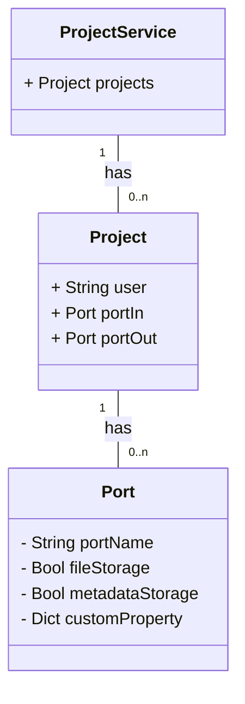

# Introduction

This service provides a project-based information store so that all other microservices can refer to it. Among other things, it determines which ports should be used when publishing data.

## Explanation of the term research project

Due to the very high frequency of the term *project* in computer science and related services, we had to choose a different term within the RDS system to simplify communication between users and/or developers. That's why we chose the term research project to refer to projects within the RDS system, which can be loosely translated into English as *Research*, so that we can always distinguish which project is meant in the dialog: either the research project in the RDS system or the project of an associated service. It also increases readability and clarifies the meaning of terms within this documentation and the RDS implementation enormously.

For example, it is clear which ID is involved if the API endpoint requires a *research-id* (rds internal project identifier) or a *project-id* (service-specific project identifier). Which *project-id* it is depends on the context, e.g. the port of the Zenodo service often requires a *project-id*, which is assigned specifically for Zenodo.

## ER Diagram

The internal information model is presented in the following as a UML diagram, but should please be understood as an ER diagram.

# OpenAPI v3



{}
