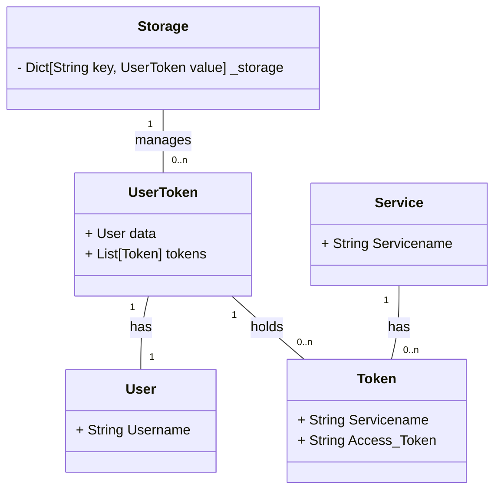

## Verschlüsselung

Aufgrund der hohen Sicherheit in RDS, muss die Kommunikation zwischen den Plugins und dem RDS-System verschlüsselt sein bzw. mindestens signiert werden. Da ein OAuth2-Provider zur Authentifizierung benötigt wird, wird bereits zu Beginn der Konfiguration ein Client-Secret vom Provider an das RDS-System übergeben. Dieses Secret wird als Passwort verwendet, um die weitere Kommunikation zwischen den beiden Systemen zu verschlüsseln.

Falls dieses Passwort korrumpiert wird, kann eine angreifende Person ein eigenes System aufsetzen und sich als RDS-System ausgeben und somit eine Man-in-the-Middle Attacke ausführen, womit sämtliche Kommunikation zwischen dem Provider und dem RDS-System, trotz einer Verschlüsselung, gebrochen ist. Aus diesem Grund kann das OAuth2-Secret als Schlüssel verwendet werden. Können wir diesem Secret nicht trauen, so ist die gesamte Kommunikation nicht sicher (auch ohne dieses Secret als Key für eine synchrone Verschlüsselung).

Aufgrund der Geheimhaltung des Oauth2-secrets, muss sämtliche Kommunikation der Plugins durch eine Serverstruktur geleitet werden, welcher Zugriff auf dieses Secret besitzt. Dies muss dann hinter einer Login-Seite liegen, sodass der Nutzer authentifiziert sein muss. Somit kann RDS also sicher sein, dass die Anfrage auch authorisiert ist durch den Nutzer, da wir dem Plugin-System vertrauen. Können wir dies nicht, so ist auch der OAuth2-Provider nicht vertrauenswürdig, da eine angreifende Person sich als eine andere Person ausgeben kann, womit OAuth2 sein vertrauen verlieren würde.

## UML-Diagramm

Aufgrund der hohen Relevanz einer einwandfreien Speicherung der Nutzertokens, wird im folgenden ein UML-Diagramm mit Kardinalitäten dargestellt, welches die Speicherstruktur der Daten beschreibt.

Aktuell kann jeder User nur einen Token für jeden Service besitzen. Dies wird aktuell dadurch gewährleistet, dass Tokens bereits dadurch gleich sind, wenn ihre Servicename übereinstimmen.

## Planungen

Durch die einfachere Handhabung werden aktuell die Daten nur im Speicher abgelegt. Das heißt, sobald der Service abbricht, gehen auch sämtliche Daten verloren, wodurch alle Nutzer sich nocheinmal neu anmelden müssen. Dies soll in Zukunft durch eine persistente und clusterübergreifende Speicherung behoben werden.
