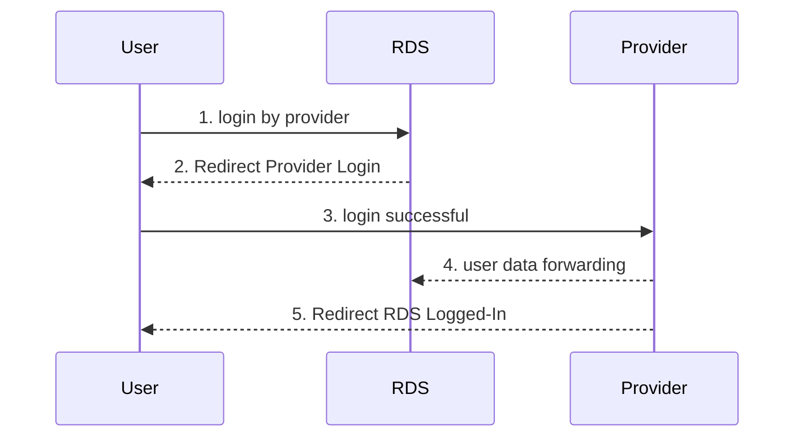
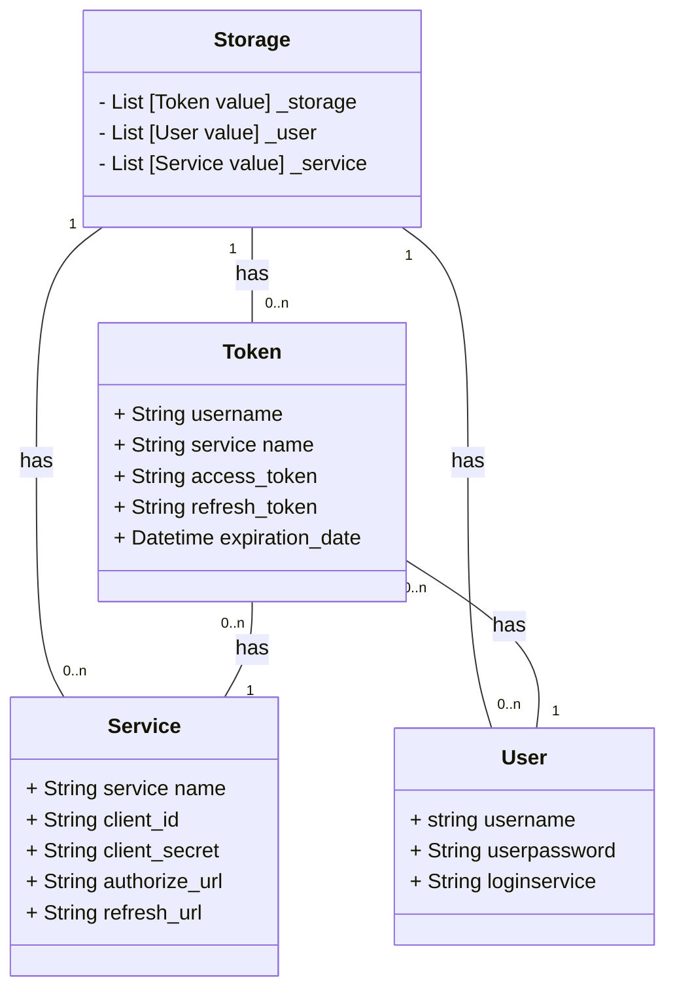
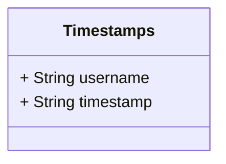

# Introduction

This service provides secure handling and exchange of passwords and other access tokens.

## Encryption

Because of the high security in RDS, the communication between the plugins and the RDS system must be encrypted or at least signed. Since an OAuth2 provider is required for authentication, a client secret is passed from the provider to the RDS system at the very beginning of the configuration. This secret is used as a password to encrypt further communication between the two systems.

If this password is corrupted, an attacker can set up his own system and pretend to be an RDS system and thus carry out a man-in-the-middle attack, whereby all communication between the provider and the RDS system is broken, despite encryption. For this reason the OAuth2-Secret can be used as a key. If we cannot trust this secret, the entire communication is not secure (even without this secret as a key for synchronous encryption).

Because of the secrecy of the Oauth2-secret, all plugin communication must be routed through a server structure that has access to this secret. This must then be behind a login page, so that the user must be authenticated. So RDS can be sure that the request is authorized by the user, because we trust the plugin system. If we can't do this, the OAuth2 provider is not trustworthy either, because an attacker can impersonate another person, and OAuth2 would lose its trust.

## ER Diagram

Due to the high relevance of a faultless storage of the user tokens, a UML diagram with cardinalities describing the storage structure of the data is presented in the following.
If deployed in a cluster environment, data will be stored in a redis store.

Currently, each user can only have one token for each service. This is currently ensured by the fact that tokens are already identical if their service names match.
Because the data will be stored in a dict-like (hashmap) structure, we use the username as the key. To be unique over multiple instances, we use the cloudID from EFSS to get a unique username with instance domain.

### Automatic clean up data

Because we need to get rid of data, which will not be used anymore, we track the last access time for all users in a separate structure. The following diagram will be stored in redis, if it is deployed in a cluster environment.
A scheduler runs every 2 hours through the Timestamps and checks, if there are usernames with a timestamp > 180 days in the past. Then it deletes the username and all related Tokens (and in research manager, it deletes all researches). To get rid of old timestamps, it waits additional 30 days before the timestamps will be deleted (so all services have enough time to run the schedulers).

The timestamps will be updated everytime anything access data for a username in research central service, regardless it is the user himself or another service identity. Token Storage only updates the timestamps once while user connects the first time. After this only research changes updates the timestamp after account creation.

The timestamp dict look like this (username is key, timestamp is value):

# Update services

If a service that has already been stored in the token storage is to be updated, it must be deleted beforehand. Otherwise, the client will receive a 409 (Conflict) in the HTTP status code, indicating that the service has not been updated. A request should then be made using the DELETE method for the service in question. Then the previous request can be made again and should generate a 200 (OK) response.

# OpenAPI v3



{}
