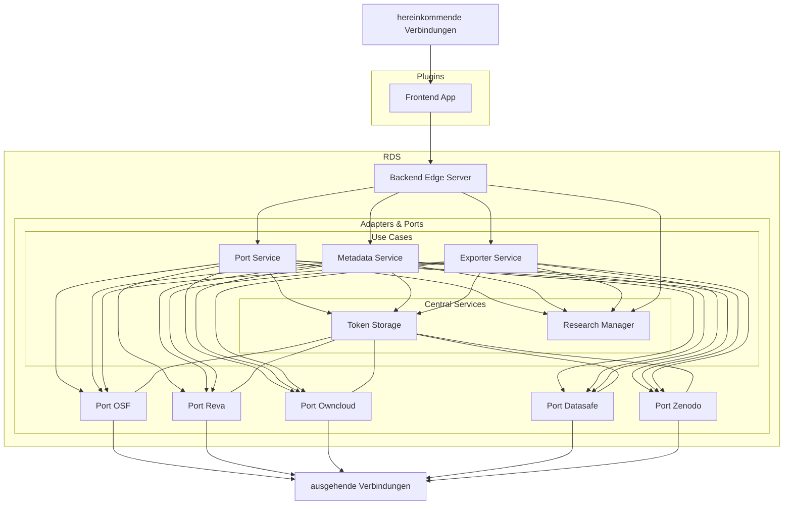

## Diagramm

Das folgende Diagramm zeigt den Datenfluss innerhalb des RDS Ökosystems. Jeder Service ist verlinkt, sodass man von hier aus sehr schnell in die entsprechende Dokumentation schauen kann, indem man auf den jeweiligen Knoten drückt.

Hereinkommende Verbindungen werden u.a. von den Plugins aufgebaut (aktuell Owncloud). Weitere Integrationen sind möglich. (Informationen hierzu werden noch nachgetragen.)

