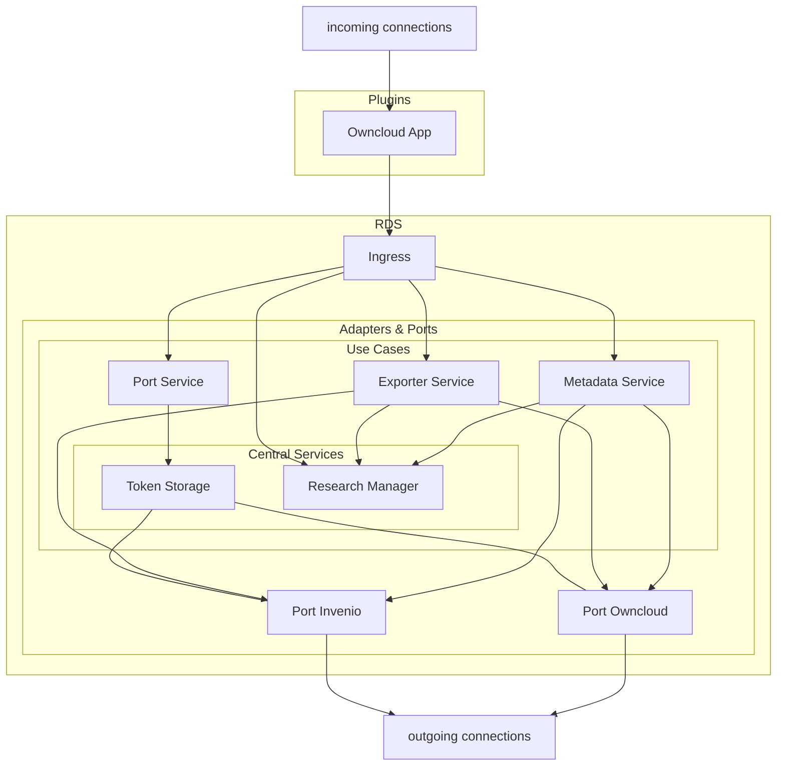

## Diagram

The following diagram shows the data flow within the RDS ecosystem. Each service is linked, so from here you can quickly look up the corresponding documentation by clicking on the respective node.

Incoming connections are established by the plugins (currently Owncloud). Further integrations are possible. (Information about this will be added later).

