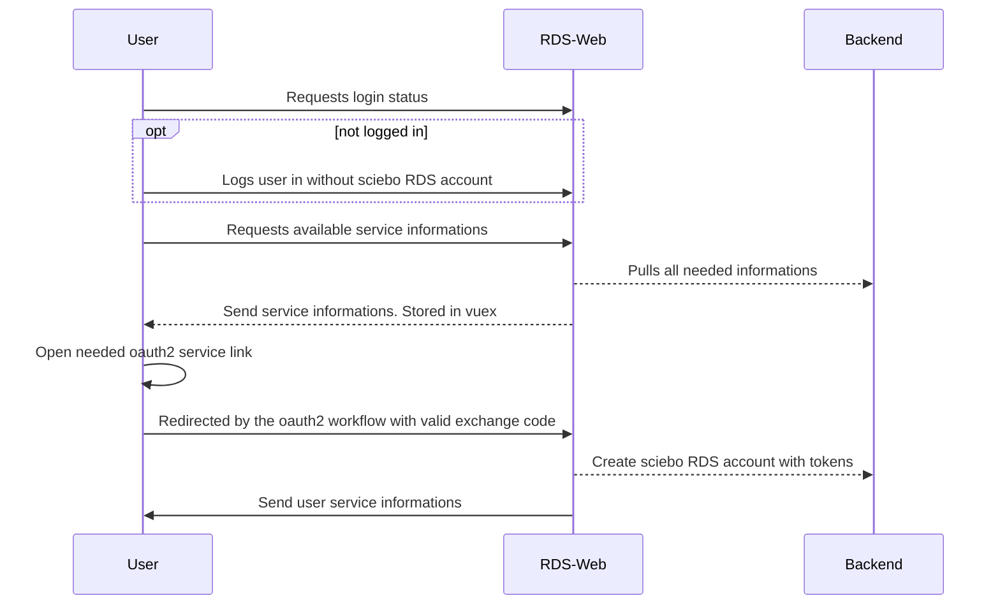

# Introduction

This service provides the entrypoint to sciebo RDS, so it provides the user frontend. The user frontend can be used standalone or integrated into other interfaces with an iframe. Also it handles the communication between the backend and the frontend via socket.io with the help of vuex stores. So the backend can send data to the frontend without the need of interactions from the user.

The integration of the frontend is handled by the plugins.

# Sequences

In the following you can see how some important flows are working.

## User provider login

## User oauth2 authentication 

Mainly the same as provider login except the login stuff, because the user is already logged in with valid provider<->sciebo RDS connection.

## Research creation and update
