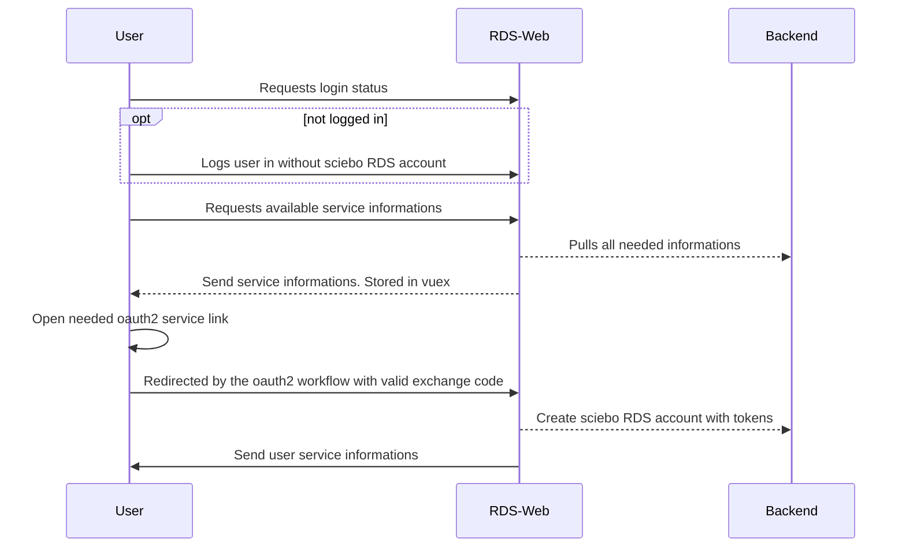
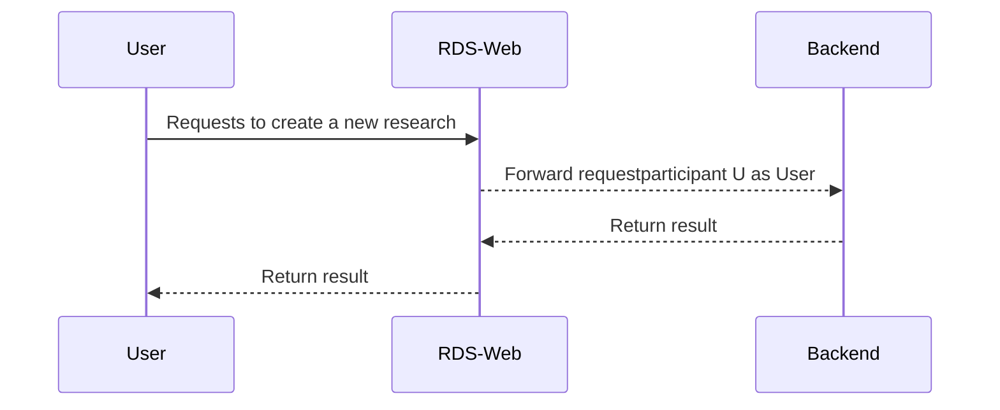

# Introduction

This service provides the entrypoint to sciebo RDS, so it provides the user frontend. The user frontend can be used standalone or integrated into other interfaces with an iframe. Also it handles the communication between the backend and the frontend via socket.io with the help of vuex stores. So the backend can send data to the frontend without the need of interactions from the user.

The integration of the frontend is handled by the plugins.

# Sequences

In the following you can see how some important flows are working.

## User provider login

## User oauth2 authentication 

Mainly the same as provider login except the login stuff, because the user is already logged in with valid provider<->sciebo RDS connection.
Because the user is logged in already, all new oauth2 codes will be stored under this login name. So you have to redirect the user always on the same endpoint for code exchange. It only differs if the user has a service already stored in the login session or not. If there is none, the next service will be used as the main integration service. All services after this are behind this service and are available as connectors. But all of this will be handled by the backend service port2 in layer2.

## Research creation and update

Research creation is simple straight forward. The frontend transforms the structure of the backend into an easier and javascript friendly structure. Update is very equal to creation, except you modify the object to your needs by hand. The frontend server will transform it back to original form and backend will take care to adjust the data object to your changes.

RDS-Web only access backend services in layer 2. In most cases this is port service in layer2. The other services are only accessed for files export and metadata exchange.
