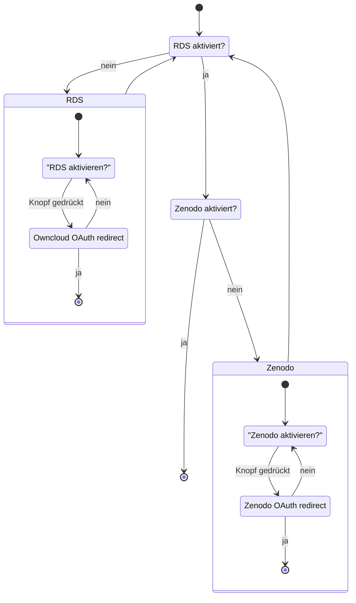

## aktueller Stand

Noch nicht implementiert.

## Eingabemasken der Einstellungen

```mermaid
stateDiagram
  [*] --> Start
  Start --> RDS: nein
  Start --> Z: ja
  Z --> Zenodo: nein
  Z --> [*]: ja

  RDS --> Start
  Zenodo --> Start

  Start: RDS aktiviert?
  Z: Zenodo aktiviert?

  state RDS {
    [*] --> A
    A --> B: Knopf gedrückt
    B --> [*]: ja
    B --> A: nein

    A: "RDS aktivieren?"
    B: Owncloud OAuth redirect
  }

  state Zenodo {
    [*] --> M
    M --> N: Knopf gedrückt
    N --> [*]: ja
    N --> M: nein

    M: "Zenodo aktivieren?"
    N: Zenodo OAuth redirect
  }
```
