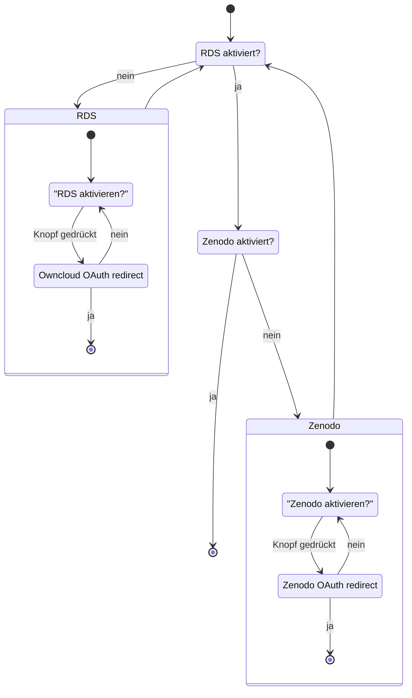
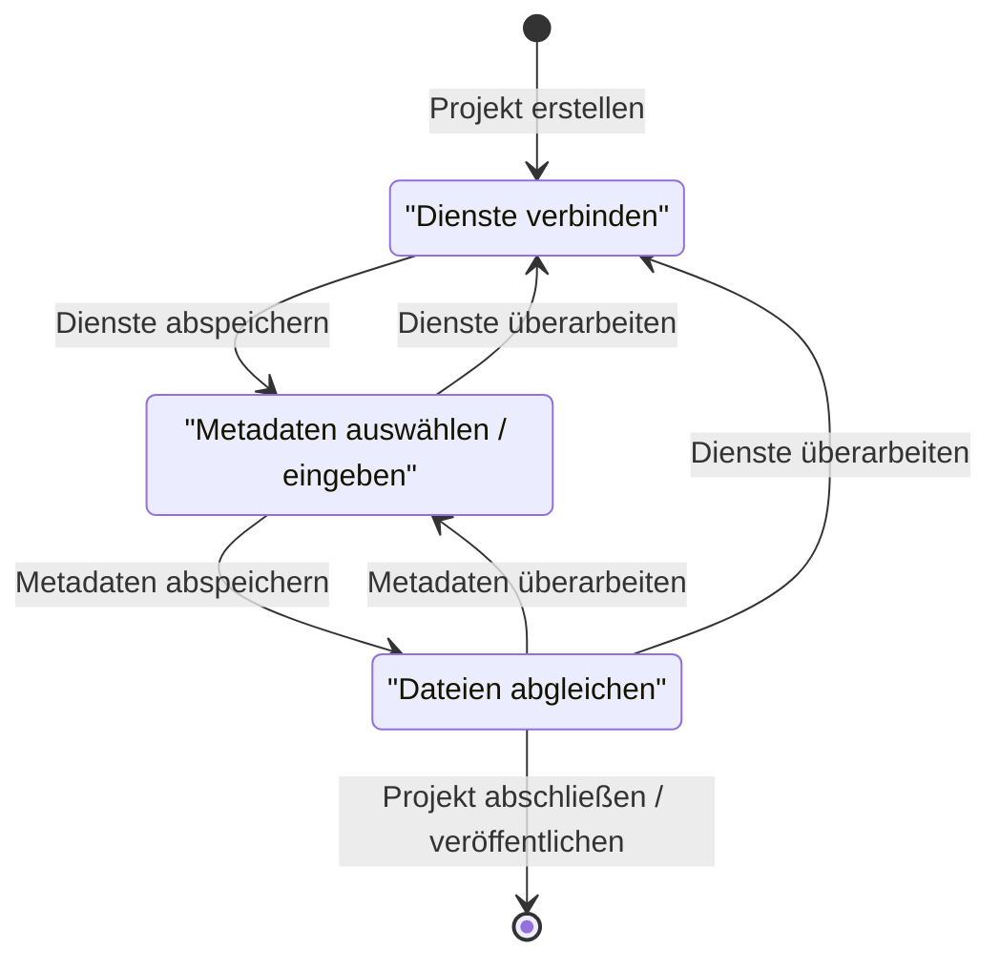

Dieser Plugin stellt die erste Integration von RDS in ein anderes Ökosystem dar. Um die Bedienbarkeit zu gewährleisten und möglichst niedrigschwellig zu gestalten, wird darauf geachtet, möglichst sämtliche Funktionsmöglichkeiten der Plattform zu verwenden und durch RDS zu erweitern.

## Abhängigkeiten

Es wird die [OAuth2-App](https://marketplace.owncloud.com/apps/oauth2) von ownCloud benötigt.

Achtung: Die OAuth2-App benötigt das PHP-Modul `php-gmp`.

## Installation

Es gibt zwei Wege, das Plugin auf einer ownCloud Instanz zu aktivieren.

### offizieller Marktplatz

Das Plugin kann auf dem offiziellen [Marktplatz von ownCloud](https://marketplace.owncloud.com/apps/rds) gefunden und von daaus installiert werden. [In der offiziellen Dokumentation](https://doc.owncloud.com/server/admin_manual/installation/apps_management_installation.html) wird beschrieben, wie ein Plugin installiert wird.

### Manuell

Das Plugin liegt im [Git-Repo im Ordner plugins](https://github.com/Sciebo-RDS/Sciebo-RDS/tree/master/plugins/ownCloud). Das Repositorium muss kopiert und anschließend der *rds*-Ordner in den *Apps*-Ordner der Owncloud-Instanz verschoben werden. Die folgenden Befehle kopieren das Git-Repo in den aktuellen Ordner und kopieren die notwendigen Dateien. Angenommen wird, dass die Owncloud-Instanz sich unter */var/www/html/owncloud* befindet. Dies kann in der ersten Zeile angepasst werden.

```bash
export OWNCLOUD_INSTALLATION=/var/www/html/owncloud
git clone https://github.com/Sciebo-RDS/Sciebo-RDS.git
cp -r Sciebo-RDS/plugins/ownCloud/rds $OWNCLOUD_INSTALLATION/apps/
```

Nun kann die *RDS*-App in den Einstellungen aktiviert (`https://localhost/owncloud/index.php/settings/admin?sectionid=apps&category=disabled`) werden. Anschließend muss der Administrator in den Administratoreneinstellungen die RDS App konfigurieren, wie im folgenden beschrieben.

## Einstellungen

### SELinux

Falls SELinux zum Einsatz kommt, so muss dem `httpd`-Server die Erlaubnis gegeben werden, Netzwerkanfragen machen zu dürfen. Dies kann mit dem folgenden Befehl durchgeführt werden. Es wird kein Neustart benötigt.

```bash
sudo setsebool -P httpd_can_network_connect on
```

### Administratorensicht

Sobald das Plugin in Owncloud, zum Beispiel aus dem Apps Market, muss das RDS System in den Einstellungen konfiguriert werden.

Hier müssen Sie den Namen der anderen Anwendung eingeben, den Sie bei der Installation von kubernetes für das rds-System festgelegt haben. Im folgenden Beispielbild wurde sie `sciebords` genannt. Die in diesem Beispiel verwendete Konfiguration ist auf dem zweiten Bild zu sehen.


### Einstellungen Nutzersicht

In den Einstellungen hat der Nutzer die Möglichkeit, OAuth Tokens und Passwörter (welche ebenfalls als Tokens bezeichnet werden im Folgenden) im System zu hinterlegen, womit sich das System im Namen des Nutzers bei verschiedenen Diensten anmelden kann. Das folgende Zustandsdiagramm stellt den Ablauf dar.

## Entwicklung

### Eingabemasken der Einstellungen



### Verweis auf Token Service auf Ebene 2

Der hintergründige Ablauf der Eingabemasken wird stark durch den entsprechenden Use-Case Dienst beeinflusst. Dafür muss man auf jedenfall die Seite des [Token Services](/de/doc/impl/use-cases/port-service/#kommunikation-mit-den-plugins) betrachten.

Notiz: Dieser Verweis wird in Zukunft verschwinden, da der Token Service entfernt wird und die Aufgabe vom Token Storage auf Ebene 3 übernommen wird, um klarere Aufgabenbereiche abzustecken.

## Projekte

Um die Tokens im vorherigen Abschnitt auch sinnvoll verwenden zu können und somit Workflows zwischen den Diensten implementieren zu können, werden Projekte angelegt, welche diese Zusammenhänge darstellen. Dafür bekommt der Nutzer wiederum eine Eingabemaske angezeigt. Das folgeden Zustandsdiagramm stellt die Abfragen dar.

### Übersichtsseite

Der Nutzer hat zu Beginn eine Übersichtsseite, welche leer ist. Er hat die Möglichkeit ein neues Projekt zu erstellen, womit er zur Eingabemaske weitergeleitet werden, welche folgendes Zustandsdiagramm verfolgt.

### Eingabemaske zur Projekterstellung

Jederzeit kann der Nutzer seinen aktuellen Stand verlassen und zur Übersicht zurückkehren. Seine bisherigen Angaben werden dabei nicht gelöscht, sondern der Zustand wird beibehalten bis er das Projekt abschließt oder löscht.


