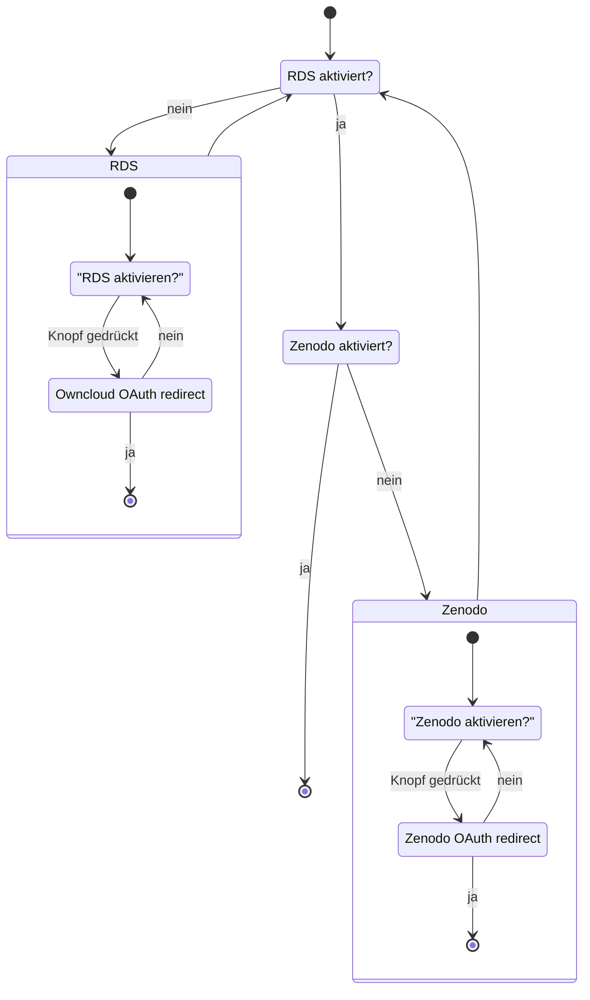
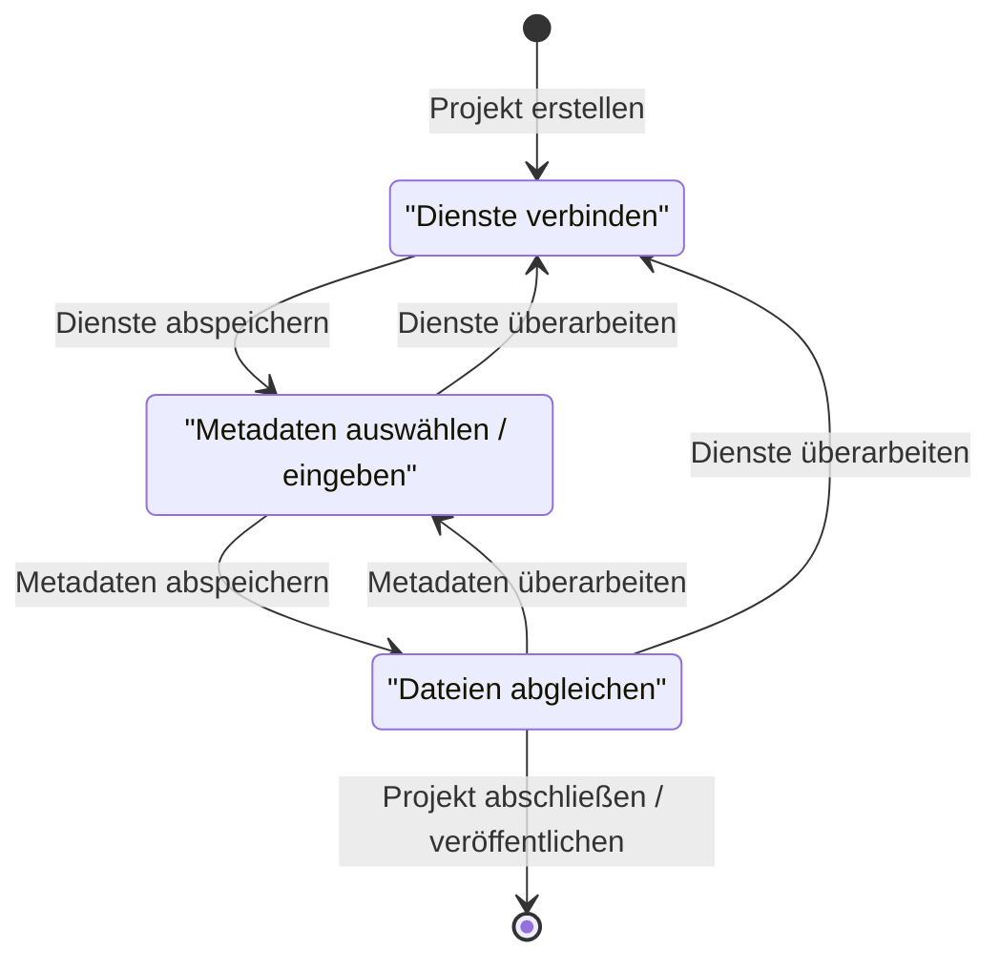

## aktueller Stand

(Oauth) Tokens lassen sich hinterlegen und löschen. Als nächstes müssen Projekte erstellt werden, um die Tokens auch in einem Workflow verwenden zu können.

## Einstellungen

In den Einstellungen hat der Nutzer die Möglichkeit, OAuth Tokens und Passwörter (welche ebenfalls als Tokens bezeichnet werden im Folgenden) im System zu hinterlegen, womit sich das System im Namen des Nutzers bei verschiedenen Diensten anmelden kann. Das folgende Zustandsdiagramm stellt den Ablauf dar.

### Eingabemasken der Einstellungen

### Verweis auf Token Service auf Ebene 2

Der hintergründige Ablauf der Eingabemasken wird stark durch den entsprechenden Use-Case Dienst beeinflusst. Dafür muss man auf jedenfall die Seite des [Token Services](/de/doc/impl/use-cases/port-service/#kommunikation-mit-den-plugins) betrachten.

Notiz: Dieser Verweis wird in Zukunft verschwinden, da der Token Service entfernt wird und die Aufgabe vom Token Storage auf Ebene 3 übernommen wird, um klarere Aufgabenbereiche abzustecken.

## Projekte

Um die Tokens im vorherigen Abschnitt auch sinnvoll verwenden zu können und somit Workflows zwischen den Diensten implementieren zu können, werden Projekte angelegt, welche diese Zusammenhänge darstellen. Dafür bekommt der Nutzer wiederum eine Eingabemaske angezeigt. Das folgeden Zustandsdiagramm stellt die Abfragen dar.

### Übersichtsseite

Der Nutzer hat zu Beginn eine Übersichtsseite, welche leer ist. Er hat die Möglichkeit ein neues Projekt zu erstellen, womit er zur Eingabemaske weitergeleitet werden, welche folgendes Zustandsdiagramm verfolgt.

### Eingabemaske zur Projekterstellung

Jederzeit kann der Nutzer seinen aktuellen Stand verlassen und zur Übersicht zurückkehren. Seine bisherigen Angaben werden dabei nicht gelöscht, sondern der Zustand wird beibehalten bis er das Projekt abschließt oder löscht.

