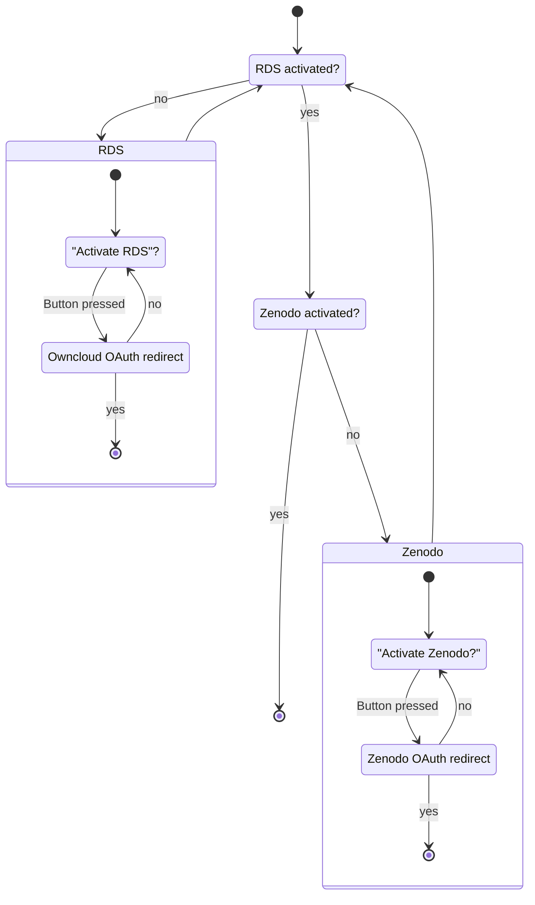
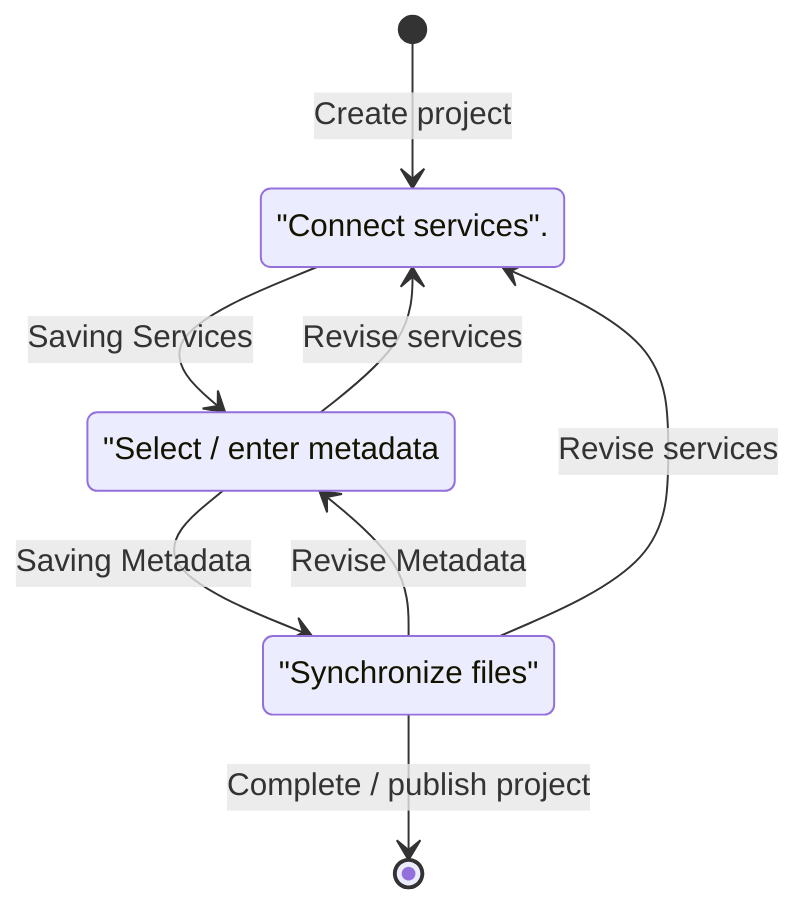

This plugin represents the first integration of RDS into another ecosystem. In order to ensure usability and to keep the threshold as low as possible, care is taken to use as many functionalities of the platform as possible and to extend them by RDS.

## Dependencies

This plugin needs the [OAuth2-App](https://marketplace.owncloud.com/apps/oauth2) from ownCloud for third-party-authentication, which depends on the php-extension `php-gmp`.

Also, RDS-App uses the [jwt-framework](https://web-token.spomky-labs.com/introduction/pre-requisite) for public-private-key generation and encoding, so you need to fulfill the requirements of this framework too. Install the php-extensions for `openssl` and `php-mbstring`. You can confirm this via `php -i | grep -E "openssl|mbstring"`.

## Installation

There are two ways to install the plugin on an existing ownCloud instance.

### official Marketplace

The plugin can be found in the official [marketplace of ownCloud](https://marketplace.owncloud.com/apps/rds). [Read the official doc](https://doc.owncloud.com/server/admin_manual/installation/apps_management_installation.html), where you can find how to install a plugin.

### Manually

The plugin is located in a [separated Git-Repository](https://github.com/Sciebo-RDS/plugin-ownCloud.git). The repository must be copied and then the *rds* folder must be moved to the *Apps* folder of the owncloud instance. The following commands copy the git repo to the current folder and copy the necessary files. Assume that the owncloud instance is located at */var/www/html/owncloud*. This can be adjusted in the first line.

```bash
export OWNCLOUD_INSTALLATION=/var/www/html/owncloud
git clone https://github.com/Sciebo-RDS/plugin-ownCloud.git
cp -r rds $OWNCLOUD_INSTALLATION/apps/
```

Now the *RDS* app can be activated in the administrator account (`https://localhost/owncloud/index.php/settings/admin?sectionid=apps&category=disabled`). Then the administrator has to configure the RDS app in the administrator settings, as described below.

## Configuration

Now you need to configure the plugin.

### SELinux

If SELinux is used, the `httpd` server must be given permission to make network queries. This can be done with the following command. No restart is required.

```bash
sudo setsebool -P httpd_can_network_connect on
```

### View as administrator

Once the plugin has been installed and activated in Owncloud, the RDS system must be configured in the settings.

Here you need to enter the name of the oauth application, which you set for the rds system during the kubernetes installation process. As the url, you have to provide your cluster ip, where sciebo RDS is running: https://`your-cluster-domain-for-sciebo-rds`. In the following example image, it was named `sciebords`. The oauth configuration, which were used in this example, can be seen in the second image.


### View as user

In the settings, the user has the option of storing OAuth tokens and passwords (which are also referred to as tokens in the following) in the system, with which the system can log on to various services on behalf of the user. The following status diagram illustrates the process.

## Developing

### Input masks of the settings



### Reference to Token Service on level 2

The background flow of the input masks is strongly influenced by the corresponding use case service. Therefore you have to look at the [Token Services](/doc/impl/use-cases/port-service/#communication-with-the-plugins) page.

Note: This reference will disappear in the future, as the Token Service will be removed and the task will be taken over by the Token Storage on level 3 to define clearer tasks.

## Projects

In order to be able to use the tokens in the previous section in a meaningful way and thus implement workflows between the services, projects are created which represent these connections. For this purpose, the user is presented with an input mask. The following status diagram shows the queries.

### Overview page

The user has an overview page at the beginning, which is empty. He has the possibility to create a new project, with which he is forwarded to the input mask, which follows the following state diagram.

### Input mask for project creation

At any time the user can leave his current status and return to the overview. His previous information is not deleted, but the status is maintained until he completes or deletes the project.


