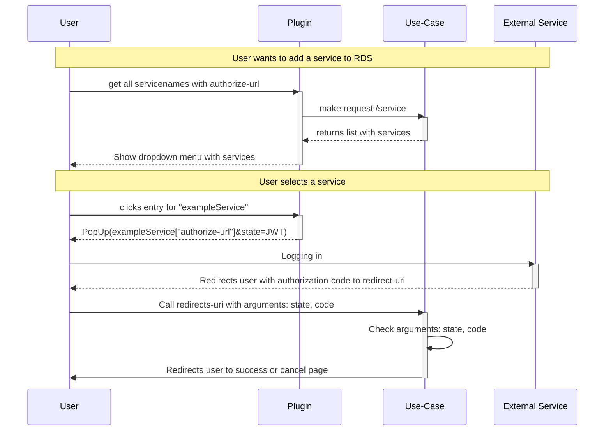

# Kommunikation mit den Plugins

Aufgrund der hohen Relevanz des zentralen Dienstes *Token Storage*, soll eine direkte Kommunikation zwischen diesen und der Außenwelt verhindert werden. Dafür kann der Anwender den TokenStorage Dienst im zweiten Zirkel verwenden, welcher die Funktionen für den Nutzer des zentralen Dienstes im dritten Zirkel anspricht. Für die Bequemlichkeit werden viele Konzepte erneut wegabstrahiert, sodass die Handhabung sehr bequem und einfach bleibt.

Die Plugins müssen folgendes Sequenzdiagramm befolgen, sodass es Zugangsdaten eines Nutzers für einen anzuschließenden Dienst im RDS-System hinterlegen kann.

Das State-Argument wird, genauso wie das Code-Argument, mittels Query-Parameter weitergeleitet. Das Plugin entnimmt den JWT aus den Daten des Services. Durch den State kann der Service verifizieren, zu welchem Service der Code gehört.

## Service einem Nutzer zuordnen

Bei einem Blick in die OpenAPI-Spezifikation ist ersichtlich, dass es keinen Endpunkt gibt, welcher Daten entgegennimmt. Das Hinzufügen eines Nutzers wird durch die `redirect_uri`-Resource im OAuth2-Workflow vollzogen, welcher auf den Enpdunkt `/redirect` verweisen muss. Der Nutzer wird dabei direkt auf das RDS weitergeleitet und erhält eine Rückmeldung über den Erfolg oder Misserfolg. Ob die Anfrage valide oder nicht ist, wird auch durch den Inhalt des `state`-Arguments (einem JWT Objekt) bestimmt, da dieser Informationen über die Anfrage enthält, welche durch die Signatur validiert werden.

## OpenAPI



{}
