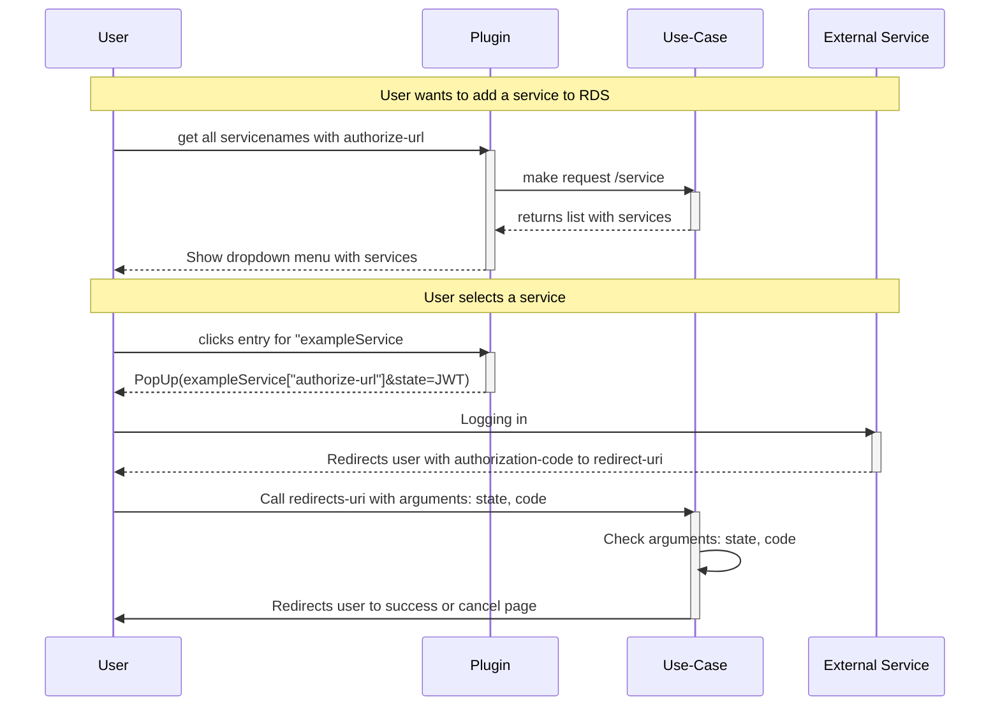

This service implements the communication between the plug-ins, the token storage, the Research Manager and the ports, among other things by implementing the Oauth2 code exchange workflow and thereby generating and storing the access and refresh token in the token storage and creating projects and storing services.

# Communication with the plugins

Due to the high relevance of the central service *Token Storage*, a direct communication between these and the outside world should be prevented. For this purpose the user can use the *Port* service in the second circle, which addresses the functions for the user of the central service in the third circle. For convenience, many concepts are again abstracted away so that the handling remains very convenient and simple. The service also handles the entire server part of the OAuth workflow.

The plug-ins must follow the sequence diagram below so that it can store a user's credentials for a service to be connected in the RDS system

The state argument, like the code argument, is forwarded using query parameters. The plugin takes the JWT from the service data. Using the state, the service can verify to which service the code belongs.

## Assign service to a user

If you take a look at the OpenAPI specification, you can see that there is no endpoint that accepts data. Adding a user is done by the `redirect_uri' resource in the OAuth2 workflow, which must point to the `/redirect' endpoint. The user is then forwarded directly to the RDS and receives feedback on success or failure. Whether the request is valid or not is also determined by the content of the `state' argument (a JWT object), since it contains information about the request, which is validated by the signature.

## OpenAPI



{}
