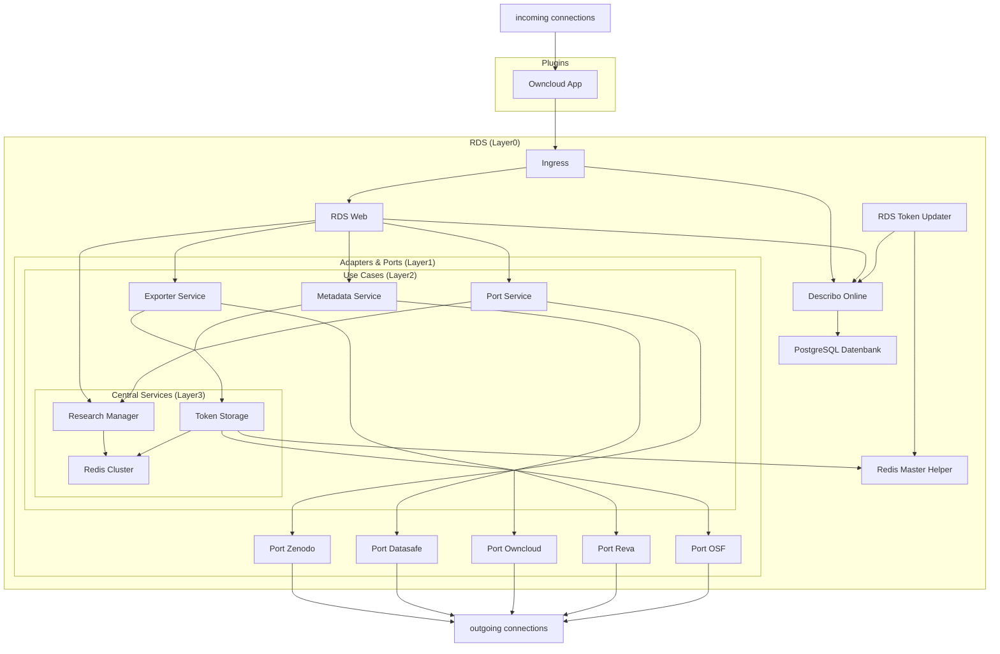

# Internal Microservices

The following diagram shows the data flow within the RDS ecosystem. Each service is linked, you can quickly look up the corresponding documentation by clicking on the respective node.
Incoming connections are established by the EFSS plugin (e.g. Owncloud).

