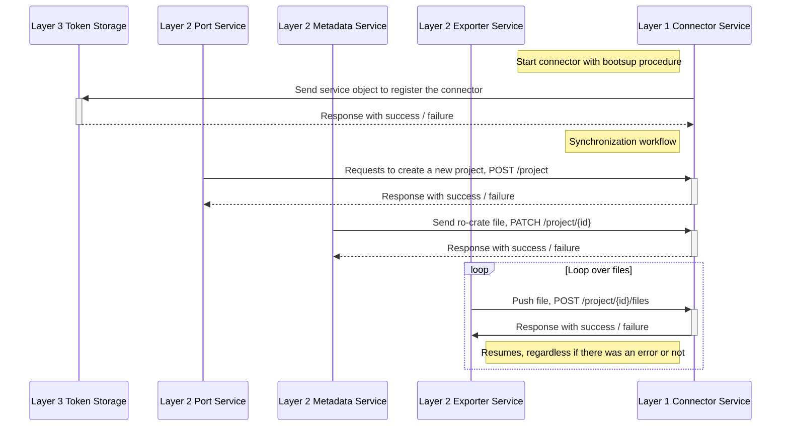

# Developing a Connector

A Connector is a Microservice that integrates a Data Service (like Owncloud or Zenodo) into RDS and is located in [layer 1](#). It has to register to the Token Storage for it to be able to provide a authentication process within RDS. The Data Service needs to be able to perform authentication via oauth2 and you must register an application with the storage provider to get API access. The Token Storage requires all Oauth2 workflow information (Client ID, Client Secret, authorize url, etc.) of the data storage. Registration is done via the "service" endpoint of the [Token Storage](#).

<!-- Since your microservice integrates a service into the RDS system, it must register in the Token Storage so that it can offer your microservice in the plugins in the registration process. The Token Storage requires all Oauth2 workflow information (Client ID, Client Secret, authorize url, etc.). For this you use the *service* endpoint of the [Token Storage](/doc/impl/central/token-storage). -->


[Fullscreen](/img/workflowSync.svg)

The first action of your connector should be to login to the service it connects to - the login should certainly happen before the connector starts it's own API.    
Your connector corresponds to one or both of two different types of service connectors, each one having their own interface in form of a OpenAPIv3 specification to implement. The distinction between service connector types is relevant when it comes to internal communication with other microservices.

The different connector types are <u>file storage</u> and <u>metadata storage</u>:

| Interface        | Implements                                                                                                                         | Example Connector | Description                                                                            |
|------------------|------------------------------------------------------------------------------------------------------------------------------------|-------------------|----------------------------------------------------------------------------------------|
| File Storage     | [fileStorage](https://raw.githubusercontent.com/Sciebo-RDS/Sciebo-RDS/master/RDS/layer2_use_cases/interface_port_file_storage.yml) | Owncloud          | Used to communicate with EFSS backend. Mostly to get files.                            |
| Metadata Storage | [metadata](https://raw.githubusercontent.com/Sciebo-RDS/Sciebo-RDS/master/RDS/layer2_use_cases/interface_port_metadata.yml)        | Zenodo            | Used to communicate with repositories and archiving services. Mostly to push files to. |

## Registering with the Token Storage

The following is an example function of how to register your service connector with RDS' *Token Storage*, written in Python.
<!-- With the following Python function you can register your service with *Token Storage*. -->

``` python
def register_service(servicename: str, authorize_url: str, refresh_url: str, client_id: str, client_secret: str):
    tokenStorage = os.getenv("CENTRAL_SERVICE_TOKEN_STORAGE")
    if tokenStorage is None:
        return False

    data = {
        "servicename": servicename,
        "authorize_url": authorize_url,
        "refresh_url": refresh_url,
        "client_id": client_id,
        "client_secret": client_secret,
        "implements": ["fileStorage", "metadata"]
    }
    headers = {"Content-Type": "application/json"}

    response = requests.post(
        f"{tokenStorage}/service", json=data, headers=headers)

    if response.status_code is not 200:
        raise Exception(
            "Cannot find and register Token Storage, msg:\n{}".format(response.text)

    response = response.json()
    if response["success"]:
        logger.info(
            f "Registering {servicename} in token storage was successful.")
        return True

    logger.error(
        f "There was an error while registering {servicename} to token storage.\nJSON: {response}")

    return False
```

Note that the data dict has an `implements`-key, which contains a list that holds the name(s) of the interface you choose to implement. You have to set it accordingly.


## Connexion-Plus

We strongly recommend using [Connexion-Plus](https://pypi.org/project/connexion-plus/) to make working with Flask and Python easier.


## Containerisation

Place your connector inseide of a docker container, so it can be used in a kubernetes environment. All your configuration should be able through environment variables or a single file, which is placed in a single, very specific file location.
