# Microservice architecture

In this section, you will find an overview about the architecture decisions.

## Clean Architecture {#section-solid-arch}

The [SOLID principles](https://de.wikipedia.org/wiki/Prinzipien_objektorientierten_Designs#SOLID-Prinzipien) have already been successfully applied in (enterprise) software development and are known in practice for [its high maintainability and agility](https://www.informatik-aktuell.de/entwicklung/methoden/solid-die-5-prinzipien-fuer-objektorientiertes-softwaredesign.html).

The author [Robert C. Martin](https://blog.cleancoder.com/uncle-bob/2012/08/13/the-clean-architecture.html) has already thought about an architecture in 2012, but calls it *Clean Architecture* and describes it in detail in his book of the same name. Since the architecture only describes a concept of how a system can be built and the concept of microservices is seen as a deployment concept, these two concepts can be combined. [Martin also wrote about it](https://blog.cleancoder.com/uncle-bob/2014/10/01/CleanMicroserviceArchitecture.html), but in his opinion one should investigate which advantages and disadvantages one gets and the architecture should and must be able to work without microservices.


In order not to extend this documentation any further, we explicitly refer to the links in the previous section. Otherwise, it is assumed from here on that the concept of Clean Architecture has been understood by the reader.


Above all, the concept of layers and dependencies should be mentioned here.

Quelle: https://blog.cleancoder.com/uncle-bob/images/2012-08-13-the-clean-architecture/CleanArchitecture.jpg

The service system in RDS has been built on the basis of these concepts and is shown as a diagram in section [dataflow](#dataflow) later in this documentation.

Thereby...
- in the outermost layer the services are counted, which connects external and internal services to RDS. For this reason, the containers in this layer are called *ports*.
- in the middle layer contains the services that implement features. For this reason, the containers are called *Use Cases* here.
- the innermost layer contains services that store information or are so essential for the entire system that they cannot be omitted. Here the containers are named *Central*.

This division of microservices can be found in the link overview in this documentation.

### Concept of Integration

Basically the integration of the RDS application is done by the platform specific plugin system.

Due to the diverse landscape of the software, RDS has to provide the highest possible integration diversity. For this reason the decision was made to hand over this responsibility to the target platform: There must be a plugin system that allows the integration of third-party applications. For this reason, RDS only implements API endpoints and makes them available for further use. Owncloud was chosen as the first target platform. Further integrations are possible, but must adhere to the Oauth2 concept.

RDS uses the first token it receives for a user of an integration platform as the main token, so that all subsequently added tokens assigned to the same user and integration platform are interpreted as connected services and offered to the user for selection. This also results in the use of unique user names or IDs for each integration platform. Although the same user name or ID may occur several times in RDS, it must be possible to assign it uniquely with the integration platform as information. 

For this reason, it is also easy to implement new integrations by other platforms, as the new service must offer Oauth2 and the user must be able to authorise himself to RDS with this service. All services connected through RDS can then be given to the user to choose from and authorise, so that RDS can authorise itself to them on behalf of the user. For this purpose RDS offers many different API endpoints, so that the integration can only focus on displaying and sending requests and not on implementing complex algorithms.

### Security concept

The plugin and RDS Web handles all necessary security stuff, from authentication and authorization over session management to calling the backend. This is mostly done by using JWT, which is generated by the integrated EFSS.

## Dataflow

### RDS Layers
Layers are indexed from the outermost to the innermost. RDS consists of the following layers: 
- Layer 0 wraps the entire RDS application
- Layer 1 contains services that connect external and internal services to RDS. The containers in this layer are called **Ports**.
- Layer 2 contains services that implement features. These containers are called **Use Cases**.
- Layer 3 contains services that store information or are so essential for the entire system that they cannot be omitted. These containers are called **Central**.

### Diagram

This diagram shows the data flow within the RDS ecosystem. Each service is linked, you can quickly look up the corresponding documentation by clicking on the respective node.
Incoming connections are established by the EFSS plugin (e.g. Owncloud).

```mermaid
graph TD;
  %% define nodes
  
  subgraph Plugins
      OP[Owncloud App]
  end

  subgraph "RDS (Layer0)"
    Ingress[Ingress]
    Describo[Describo Online]
    Web[RDS Web]
    Helper[RDS Token Updater]
    DescriboDB[PostgreSQL Datenbank]
    RedisH[Redis Master Helper]

    subgraph "Adapters & Ports (Layer1)"
      PInvenio[Port Zenodo]
      POwncloud[Port Owncloud]
      POSF[Port OSF]
      PReva[Port Reva]
      PDatasafe[Port Datasafe]

      subgraph "Use Cases (Layer2)"
        UCExporter[Exporter Service]
        UCPort[Port Service]
        UCMetadata[Metadata Service]
        %% UCProject[Project Service]

        subgraph "Central Services (Layer3)"
          Redis[Redis Cluster]
          CSToken[Token Storage]
          CSProject[Research Manager]
        end

        Centralservices(" ")
        Ports(" ")
      end
    end
  end

  WWWI[incoming connections]
  WWWO[outgoing connections]

  click OP "/impl/plugins/owncloud/"
  click Describo "https://github.com/Arkisto-Platform/describo-online"
  click Helper "https://github.com/Sciebo-RDS/RDS-Web/tree/rework/helper"
  click Web "https://github.com/Sciebo-RDS/RDS-Web"

  click PInvenio "/impl/layer1-port-invenio-docstring"
  click POwncloud "/impl/layer1-port-storage-docstring"
  click PReva "https://github.com/Sciebo-RDS/port-reva"
  click POSF "/impl/layer1-port-osf-docstring"
  click PDatasafe "https://github.com/Sciebo-RDS/port_datasafe"

  click UCPort "/impl/layer2-port-service-docstring"
  click UCExporter "/impl/layer2-exporter-service-docstring"
  click UCMetadata "/impl/layer2-metadata-service-docstring"

  click CSProject "/impl/layer3-research-manager-docstring"
  click CSToken "/impl/layer3-token-storage-docstring"

  %% define connections
  WWWI --> OP
  OP --> Ingress --> Describo & Web

  Web --> CSProject & UCExporter & UCMetadata & UCPort & Describo
  CSToken & UCExporter & UCMetadata & UCPort --- Ports
  UCExporter & UCMetadata & UCPort --- Centralservices
  Ports --> PInvenio & POwncloud & PReva & POSF & PDatasafe
  Centralservices --> CSProject & CSToken

  CSProject --> Redis

  Helper --> Describo & RedisH
  CSToken --> RedisH & Redis
  Describo --> DescriboDB

  PInvenio & PDatasafe & POwncloud & PReva & POSF --> WWWO

classDef SkipLevel width:0px;
class Ports,Centralservices SkipLevel
```

### EFSS Integration

The integration of the RDS application into an EFSS system (*integration platform*) is realized as a native plugin through the platform's own plugin system. The plugin wraps the RDS standalone application into an iFrame and is not part of the described layering structure.

Due to the diverse landscape of EFSS software, RDS has to provide the highest possible integration diversity. For this the responsibility is handed over to the target platform: There must be a plugin system that allows for the integration of third-party applications. Owncloud is the first target platform. Further integrations must adhere to the Oauth2 concept. RDS only implements and makes available API endpoints.

RDS uses the first token it receives for a user of an integration platform as the main token, all subsequently added tokens assigned to the same user and integration platform are interpreted as connected services and offered to the user for selection. This also results in the use of unique user names or IDs for each integration platform. Although the same user name or ID may occur several times in RDS, it must be possible to attribute it uniquely to the integration platform. 

It is also easy to implement new integrations with other repository services, as the new service must offer Oauth2 and the user must be able to authorise himself to RDS with this service. All services integrated with RDS can then be given to the user to choose and authorise, so that RDS can authorise itself to them on behalf of the user. RDS offers a lot of different API endpoints, so that the integration can focus on displaying and sending requests and not on implementing complex algorithms.
